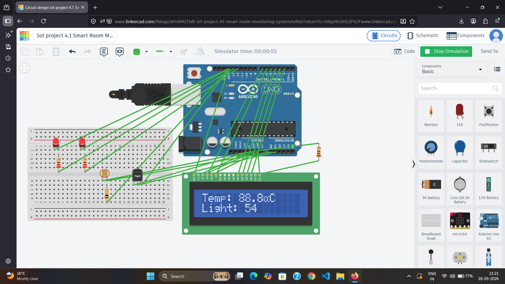

# 🌡️ Smart Room Monitoring System

An Arduino-based smart room monitoring system that monitors temperature and light intensity using sensors and displays real-time readings on a 16×2 LCD.

## 🚀 Features

- 🌡️ Temperature monitoring using TMP36
- 💡 Light intensity monitoring using LDR
- 🖥️ Real-time LCD display
- 🔴 Temperature alert LED
- 💡 Low-light alert LED
- 📟 Serial Monitor output
- 🔧 Arduino-based sensor integration

## 🛠️ Components Used

- Arduino Uno
- TMP36 Temperature Sensor
- LDR
- 10kΩ Resistor
- 16×2 LCD
- 2 × LEDs
- 2 × 220Ω Resistors
- Breadboard
- Jumper Wires

## ⚙️ Working

The TMP36 measures the room temperature while the LDR detects the light intensity.

The LCD displays both sensor readings in real time.

- Temperature above 30°C → Temperature LED ON
- Light intensity below 500 → Light LED ON

## 🔗 Tinkercad Simulation

[Open Smart Room Monitoring System in Tinkercad](https://www.tinkercad.com/things/atYvR4GTIxR-iot-project-41-smart-room-monitoring-system)

## 📸 Circuit

## 🧠 Concepts Used

- Arduino Analog Input
- Sensor Interfacing
- LCD Interfacing
- Conditional Logic
- Real-time Monitoring
- Embedded C/C++

## 🔮 Future Improvements

- Add ESP32 connectivity
- Send sensor data to an IoT cloud platform
- Add a web/mobile dashboard
- Add more environmental sensors
- Enable remote monitoring

## 👩‍💻 Author

**Tanisha Karan**  
B.Tech CSE (IoT) Student
